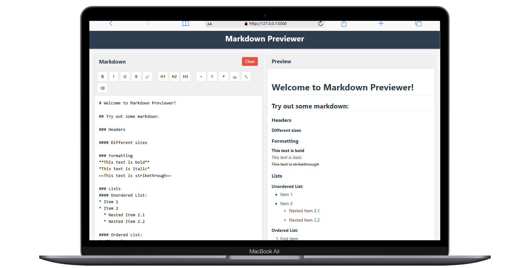

# Markdown Previewer

A simple, responsive web application that allows users to write Markdown text and see the formatted output in real-time. This project demonstrates the use of HTML, CSS, and JavaScript to create an interactive text processing tool without any backend dependencies.



# Deployment Link: 

## Features

- **Live Preview**: See your Markdown rendered in real-time as you type
- **Split View Layout**: Editor on the left, preview on the right
- **Responsive Design**: Works on desktop and mobile devices
- **Clear Button**: Reset the editor with a single click
- **Markdown Support**:
  - Headings (# H1, ## H2, etc.)
  - Emphasis (bold, italic)
  - Lists (ordered and unordered)
  - Links
  - Images
  - Blockquotes
  - Code blocks (inline and multi-line)
  - Tables
  - Horizontal rules

## Tech Stack

- **HTML5**: Semantic structure
- **CSS3**: Styling and responsive design
- **JavaScript**: DOM manipulation and event handling
- **[Marked.js](https://marked.js.org/)**: Markdown parsing library

## Getting Started

### Prerequisites

- A modern web browser (Chrome, Firefox, Safari, Edge)

### Installation

1. Clone the repository or download the source code:
   ```
   git clone https://github.com/Indra-photon/Markdown-Previewer.git
   ```

2. Open the `index.html` file in your web browser

Alternatively, you can host the files on any web server or static site hosting service.

## Usage

1. Type or paste Markdown text in the left editor panel
2. See the formatted result in the right preview panel in real-time
3. Use the "Clear" button to reset the editor

## Example Markdown

```markdown
# Heading 1
## Heading 2

**Bold text** and *italic text*

- Unordered list item 1
- Unordered list item 2

1. Ordered list item 1
2. Ordered list item 2

[Link to Google](https://www.google.com)

> This is a blockquote

`inline code`

```javascript
// Code block
function greet() {
  console.log("Hello, world!");
}
```

## Customization

You can customize the appearance by modifying the `style.css` file:

- Change colors by updating the color values
- Adjust the layout by modifying the flexbox properties
- Customize the preview styles by editing the `#preview-output` selectors

## Future Enhancements

Potential improvements that could be added:

- Syntax highlighting for code blocks
- Markdown toolbar for common formatting options
- Save/load functionality with localStorage
- Export to HTML or PDF
- Dark mode toggle

## License

This project is licensed under the MIT License - see the LICENSE file for details.

## Acknowledgments

- [Marked.js](https://marked.js.org/) - The Markdown parser used in this project
- [Digital Ocean Markdown Demo](https://www.digitalocean.com/community/markdown) - Inspiration for the layout and functionality